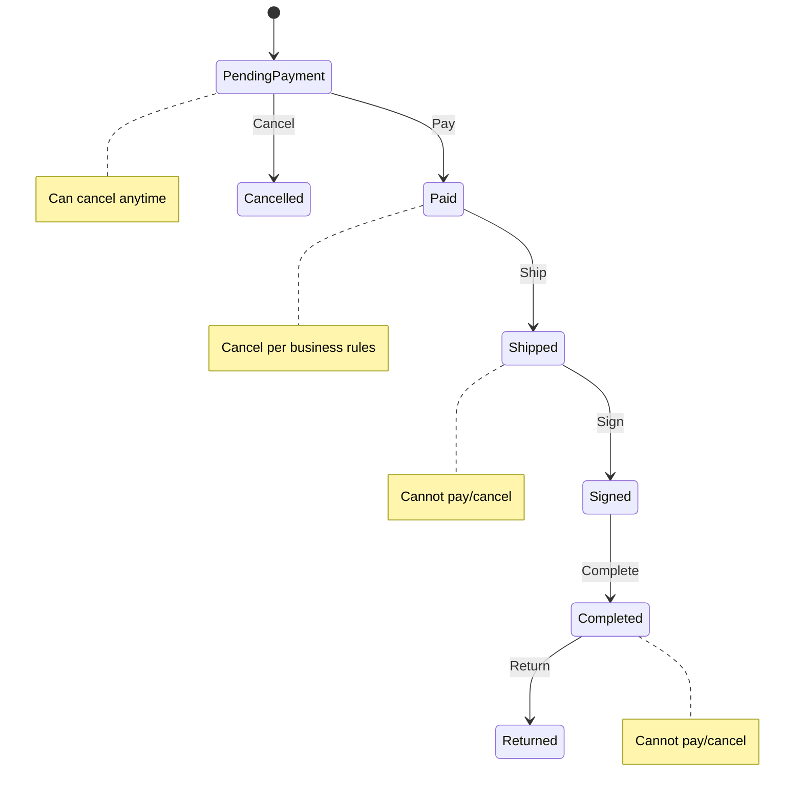
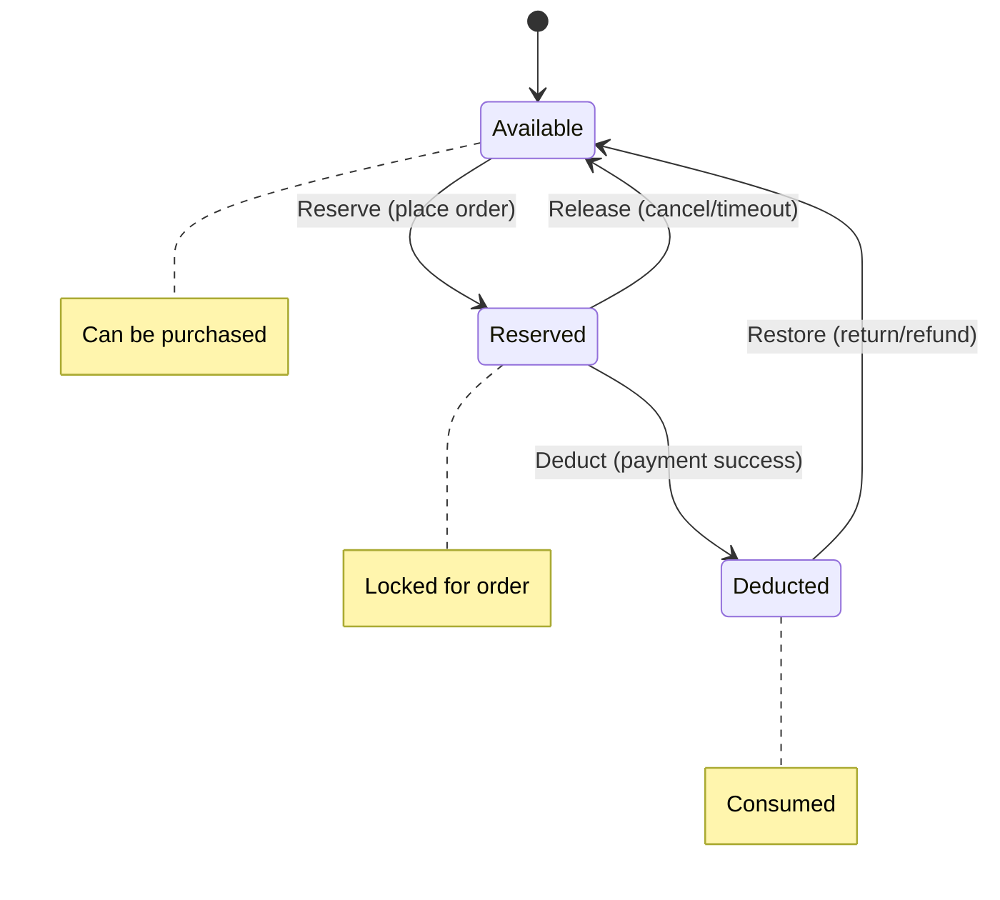
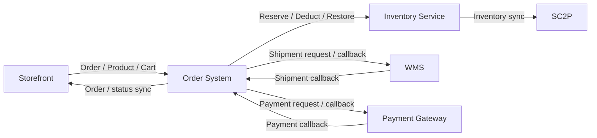

# M — Models

## M1. End-to-End Business Flow

### Business Flow

Product/SPU/SKU
→ Cart
→ Place Order
→ Inventory Reservation
→ Order Creation
→ Payment
→ Inventory Deduction
→ Shipment
→ Signed
→ Order Completion

Exception / Return Flow:

Place Order
→ Inventory Reservation
→ Payment Failure / Order Cancellation
→ Inventory Restoration

Signed / Completed
→ Return
→ Refund
→ Inventory Restoration

### Core Business Objects

- Product / SPU
- SKU
- Inventory
- Cart
- Order
- Payment
- Shipment
- Return
- WMS / SC2P

### Key Business Dependencies

- Order creation depends on successful inventory reservation.
- Payment affects the order lifecycle and inventory transition.
- Shipment depends on successful order/payment processing.
- Return and cancellation may trigger inventory restoration.
- External WMS / SC2P systems participate in inventory and fulfilment synchronization.

---

## M2. Order State Machine

### Order States

- Pending Payment
- Paid
- Shipped
- Signed
- Completed
- Cancelled
- Returned

### Valid State Transitions

### State Transition Rules

- An order can only move through valid business state transitions.
- Invalid state transitions must be rejected.
- Repeated operations should not create duplicate state transitions.
- Cancelled or completed orders must not return to earlier states.
- Payment, shipment, signing and return operations must result in consistent order states.

---

## M3. Inventory State Model

### Inventory States

- Available
- Reserved
- Deducted
- Restore

### State Transitions

### Inventory Invariants

The inventory state must remain consistent throughout the order lifecycle.

The following invariants must always hold:

1. Available inventory must never be negative.
2. Reserved inventory must never be negative.
3. Deducted inventory must never be negative.
4. Reserved quantity must not exceed the available business inventory.
5. A single business event must not change inventory more than once.
6. Inventory changes must correspond to valid order/payment/return events.
7. After successful compensation or reconciliation, inventory must return to a consistent state.
8. Concurrent purchase requests must not cause overselling.

### Key Inventory Scenarios

- Successful inventory reservation
- Failed inventory reservation
- Successful inventory deduction
- Failed inventory deduction
- Order cancellation and inventory restoration
- Return and inventory restoration
- Duplicate inventory messages
- Out-of-order inventory messages
- Concurrent inventory requests
- Zero inventory
- High-concurrency / flash-sale scenarios
- Prevention of overselling

---

## M4. External Interaction Model

### External Systems

The core system interacts with:

- Storefront
- WMS
- SC2P

### Main Interactions

### External Interaction Risks

- Request timeout
- Request failure
- Network interruption
- Duplicate requests
- Duplicate messages
- Out-of-order messages
- Lost messages
- External system unavailable
- Delayed responses

### Interaction Requirements

External interactions should consider:

- Retry
- Timeout handling
- Idempotency
- Message ordering
- Failure handling
- Compensation
- Reconciliation

---

## M5. Consistency Boundaries

### Strong Consistency

Strong consistency should be considered for core business operations where temporary inconsistency could directly cause incorrect business results.

Examples:

- Inventory reservation
- Inventory deduction
- Core order state transitions
- Payment result

Key risk:

- Overselling
- Duplicate deduction
- Incorrect order state
- Payment/order inconsistency

### Eventual Consistency

Eventual consistency can be used for interactions where temporary synchronization delays are acceptable.

Examples:

- WMS inventory synchronization
- External fulfilment status synchronization
- Asynchronous messages

The system should ensure that the data eventually reaches the expected consistent state.

### Reconciliation

For data that cannot always be guaranteed to be immediately consistent, reconciliation should be used to identify and correct differences.

Examples:

- Inventory differences between the order system and WMS
- Missing or duplicated external messages
- Orders stuck in an intermediate state
- Failed synchronization

Reconciliation process:

Detect Difference
→ Alert
→ Investigate
→ Retry / Compensate / Repair
→ Reconcile Again
→ Restore Consistency

# F — Functional

## F1. Product

### Product / SKU

- Verify product information can be displayed correctly.
- Verify SKU selection is correct.
- Verify different SKU options map to the correct SKU.
- Verify unavailable / out-of-stock SKU cannot be purchased.
- Verify product quantity and SKU information are correctly passed to the cart and order.

### Boundary Cases

- SKU with zero inventory.
- Maximum purchasable quantity.
- Quantity greater than available inventory.
- Invalid SKU.
- Product/SKU no longer available.

---

## F2. Cart

### Core Functions

- Add SKU to cart.
- Update item quantity.
- Remove item from cart.
- View cart items.
- Calculate cart quantity correctly.
- Calculate cart amount correctly.
- Continue to checkout from cart.

### Boundary Cases

- Add zero quantity.
- Add negative quantity.
- Add quantity greater than available inventory.
- Add the same SKU repeatedly.
- SKU becomes unavailable after being added to cart.
- Inventory changes after the item is added to cart.

### Validation

- Invalid SKU should be rejected.
- Invalid quantity should be rejected.
- Cart should not allow purchasing more than the valid inventory.

---

## F3. Order

### Core Functions

- Create an order from the cart.
- Verify order item information.
- Verify SKU and quantity.
- Verify order amount.
- Verify inventory reservation during order creation.
- Verify successful order creation.
- Verify failed order creation.
- Verify order cancellation.

### Boundary Cases

- Zero inventory.
- Insufficient inventory.
- Invalid SKU.
- Invalid quantity.
- Duplicate order request.
- Repeated order submission.
- Order creation timeout.
- Inventory reservation succeeds but order creation fails.

### Idempotency

Repeated requests for the same business operation should not create duplicate orders or duplicate inventory reservations.

---

## F4. Payment

### Core Functions

- Successful payment.
- Failed payment.
- Payment timeout.
- Payment cancellation.
- Payment result synchronization.
- Verify order state after payment.

### Key Scenarios

Payment Success:

Payment Success
→ Order becomes Paid
→ Inventory moves from Reserved to Deducted

Payment Failure:

Payment Failure
→ Order remains unpaid / follows cancellation flow
→ Reserved inventory is eventually released

### Exception Scenarios

- Payment succeeds but order status is not updated.
- Payment request times out.
- Payment callback is duplicated.
- Payment callback arrives late.
- Payment callback arrives out of order.

### Idempotency

Repeated payment callbacks must not cause:

- Duplicate payment processing.
- Duplicate inventory deduction.
- Invalid order state transitions.

---

## F5. Shipment

### Core Functions

- Order enters fulfilment after successful payment.
- Shipment request is created.
- Shipment succeeds.
- Shipment fails.
- Shipment status is synchronized.
- Order state is updated after shipment.

### Boundary / Exception Scenarios

- Shipment request timeout.
- WMS unavailable.
- Duplicate shipment request.
- Duplicate shipment callback.
- Shipment callback delayed.
- Shipment callback out of order.
- Shipment succeeds in WMS but response is lost.

### Partial / Split Shipment

- An order containing multiple SKUs can be fulfilled through multiple shipments.
- Each shipment should contain the correct SKU and quantity.
- Partial shipment must not incorrectly mark the entire order as completed.
- Order status should reflect the actual fulfilment progress.
- Repeated shipment notifications must be idempotent.
- Shipment quantities must not exceed the ordered quantities.
- Inventory deduction must correspond to the actual fulfilment quantity.
- All partial shipments should eventually lead to the correct final order state.

---

## F6. Signed

### Core Functions

- Customer receives the shipment.
- Order changes to Signed.
- Signed order can enter Completed state.
- Verify shipment and order status consistency.

### Exception Scenarios

- Duplicate signed notification.
- Signed notification delayed.
- Invalid order state receives signed event.
- Signed event arrives before shipment status is synchronized.

---

## F7. Return

### Core Functions

- Customer submits a return request.
- Return request is validated.
- Return is approved.
- Refund is processed.
- Inventory is restored when applicable.
- Order state is updated correctly.

### Boundary Cases

- Return after order completion.
- Invalid return request.
- Duplicate return request.
- Duplicate refund request.
- Return quantity exceeds purchased quantity.
- Return after an invalid order state.

### Inventory

Return
→ Refund
→ Inventory Restoration

Inventory restoration must not be performed more than once for the same return operation.

---

## F8. Inventory Synchronization

This is a dedicated functional area because inventory synchronization is a core consistency boundary.

### F8.1 Inventory Reservation

- Reservation succeeds.
- Reservation fails because inventory is insufficient.
- Reservation fails because SKU is invalid.
- Reservation is repeated.
- Reservation request times out.
- Reservation succeeds but the caller does not receive the response.

### F8.2 Inventory Deduction

- Deduction succeeds.
- Deduction fails.
- Deduction is repeated.
- Duplicate deduction message is received.
- Deduction message arrives out of order.

### F8.3 Inventory Restoration

- Cancelled order restores reserved inventory.
- Failed payment restores reserved inventory.
- Return restores inventory when applicable.
- Restoration is repeated.
- Restoration fails and requires retry/compensation.

### F8.4 Concurrency

- Multiple users purchase the last available item concurrently.
- Inventory must not be oversold.
- Successful reservations must not exceed available inventory.
- Concurrent requests must produce a consistent final inventory state.

### F8.5 Message Idempotency

For the same business event:

- Duplicate messages must not cause duplicate inventory changes.
- Processing the same message multiple times should produce the same final state.

### F8.6 Out-of-Order Messages

Examples:

Deduction message arrives before reservation message.

Restoration message arrives before deduction confirmation.

The system should prevent invalid inventory state transitions and provide appropriate retry or compensation handling.

---

## F9. API Validation

### F9.1 Request Parameter Validation

Verify that critical APIs validate the following and return structured error responses:

| Validation Category | Examples | Expected Behavior |
| --- | --- | --- |
| Required parameters | Missing `sku_id`, `order_id`, `quantity` | Reject with `MISSING_REQUIRED_PARAM` + field name |
| Parameter type | `quantity` = "abc", `sku_id` = null | Reject with `INVALID_PARAM_TYPE` |
| Parameter range | `quantity` = 0, -1, 999999 | Reject with `INVALID_PARAM_RANGE` + valid range |
| Parameter format | `order_id` = "", invalid UUID format | Reject with `INVALID_PARAM_FORMAT` |
| SKU validity | Non-existent SKU, deleted SKU | Reject with `SKU_NOT_FOUND` |
| Quantity validity | Exceeds max purchase limit, exceeds available inventory | Reject with `QUANTITY_EXCEEDED` |

### F9.2 Authorization and Access Control

| Scenario | Expected Behavior |
| --- | --- |
| Unauthenticated request (no/invalid token) | Reject with `UNAUTHORIZED` (HTTP 401) |
| User accesses another user's order | Reject with `FORBIDDEN` (HTTP 403) |
| User modifies another user's cart/order | Reject with `FORBIDDEN` |
| Expired or revoked token | Reject with `TOKEN_EXPIRED` |

### F9.3 Business State Validation

| Scenario | Expected Behavior |
| --- | --- |
| Pay an already-paid order | Reject with `INVALID_ORDER_STATE` |
| Cancel a completed order | Reject with `INVALID_ORDER_STATE` |
| Ship an unpaid order | Reject with `INVALID_ORDER_STATE` |
| Return an order that is not returnable | Reject with `RETURN_NOT_ALLOWED` |
| Invalid request must NOT modify inventory | Inventory remains unchanged — verify before and after |

### F9.4 Payment Callback Validation

| Callback Field | Validation |
| --- | --- |
| `transaction_id` | Must exist and match a valid payment |
| `order_id` | Must exist and be in a payable state |
| `amount` | Must match the order's expected payment amount |
| `status` | Must be a valid payment status (`SUCCESS`, `FAILED`, `TIMEOUT`) |
| `signature` | Must pass signature verification |
| `timestamp` | Must be within acceptable time window |

Invalid callback must be rejected without modifying order or inventory state.

### F9.5 Important APIs to Validate

- Product / SKU API
- Cart API (add / update / remove)
- Order API (create / cancel / query)
- Payment API (create payment / callback)
- Inventory API (reserve / deduct / restore)
- Shipment API (create shipment / callback)
- Return API (submit return / process refund)
- External synchronization APIs (WMS / SC2P)

---

## F10. Exception Handling and Compensation

### Exception Scenarios

The system should cover failures including:

- Inventory reservation failure.
- Order creation failure.
- Payment failure.
- Payment timeout.
- Inventory deduction failure.
- WMS unavailable.
- External API timeout.
- Duplicate messages.
- Out-of-order messages.
- Network interruption.
- Partial processing.

### Compensation Strategy

Example:

Order Creation
→ Inventory Reservation Success
→ Order Creation Failure
→ Release Reserved Inventory

Another example:

Payment Success
→ Order Status Update Failure
→ Retry / Reconcile
→ Restore Consistent Order State

Another example:

WMS Request
→ Timeout
→ Retry
→ If still failed
→ Compensation / Reconciliation

### Compensation Requirements

- Compensation operations must be idempotent.
- Compensation must not create duplicate inventory changes.
- Failed compensation should be retryable.
- Unresolved inconsistencies should enter reconciliation.
- Critical failures should be observable and alertable.

# Q — Quality

## Q1. Performance

### Performance Objectives

Evaluate whether the e-commerce system can maintain acceptable performance under normal traffic and high-concurrency scenarios.

### Key Scenarios

- Normal order creation.
- Concurrent order creation.
- High-concurrency inventory reservation.
- Flash-sale / high-concurrency purchase.
- Concurrent requests for the last available inventory.
- Concurrent payment callbacks.
- Concurrent inventory synchronization.
- High-volume WMS / SC2P synchronization.

### Key Metrics

| Metric | Normal Load | High Concurrency (Flash Sale) | Threshold / Alert |
| --- | --- | --- | --- |
| Order creation API latency (P99) | ≤ 200ms | ≤ 500ms | > 1s |
| Inventory reservation API latency (P99) | ≤ 100ms | ≤ 300ms | > 500ms |
| Payment callback processing latency | ≤ 300ms | ≤ 800ms | > 2s |
| Order creation TPS | ≥ 500 TPS | ≥ 2000 TPS | < 1000 TPS |
| Inventory reservation TPS | ≥ 800 TPS | ≥ 3000 TPS | < 1500 TPS |
| Error rate (all critical APIs) | < 0.1% | < 1% | > 2% |
| Overselling rate | 0% | 0% | > 0% (blocker) |
| Inventory reservation success rate | ≥ 99.9% | ≥ 99% | < 95% |
| Payment processing success rate | ≥ 99.9% | ≥ 99.5% | < 98% |
| Message processing throughput | ≥ 5000 msg/s | ≥ 10000 msg/s | < 3000 msg/s |
| Message backlog | < 100 | < 10000 | > 50000 |

### Key Risks

- Response time increases significantly under high concurrency.
- Inventory service becomes a bottleneck.
- Database contention causes inventory inconsistencies.
- Message backlog increases.
- High concurrency causes overselling.
- External system latency impacts the order flow.

---

## Q2. Reliability

### Reliability Objectives

Verify that the system can continue processing correctly when internal or external components fail.

### Failure Scenarios

- Inventory service unavailable.
- Payment service unavailable.
- WMS unavailable.
- SC2P unavailable.
- Network timeout.
- Request timeout.
- Message delivery failure.
- Duplicate messages.
- Out-of-order messages.
- Partial processing failure.

### Reliability Mechanisms

- Retry.
- Timeout handling.
- Fallback where applicable.
- Circuit breaker where applicable.
- Idempotency.
- Compensation.
- Reconciliation.

### Key Requirements

- Temporary failures should not cause permanent data inconsistency.
- Retried requests must not create duplicate business operations.
- Duplicate messages must be safely handled.
- Failed operations should be recoverable.
- Critical inconsistencies should be detected and corrected.

---

## Q3. Observability

### Observability Objectives

The system should provide sufficient logs, metrics and alerts to identify, diagnose and monitor business failures.

### Logs

Important operations should contain sufficient information for troubleshooting, including:

- Order ID.
- SKU ID.
- User / business context where appropriate.
- Inventory operation.
- Message ID.
- Request / trace identifier.
- Operation result.
- Error information.

### Metrics

Monitor:

- Order success / failure rate.
- Payment success / failure rate.
- Inventory reservation success / failure rate.
- Inventory synchronization success / failure rate.
- Inventory difference ratio.
- Message backlog.
- Retry count.
- Failed message count.
- Stuck order count.
- API latency.
- API error rate.

### Alerts

Alerts should be considered for:

- Abnormal inventory differences.
- Increasing message backlog.
- Large numbers of stuck orders.
- High API error rate.
- High timeout rate.
- Inventory synchronization failure.
- Repeated compensation failures.

---

## Q4. Security

### Authentication

Verify that only authenticated users can access protected business functions.

### Authorization

Verify that users can only perform operations allowed by their permissions.

### Data Protection

Verify that sensitive information is appropriately protected.

Examples:

- Payment-related information.
- Customer information.
- Authentication credentials.
- Sensitive business data.

### API Security

Verify:

- Unauthorized requests are rejected.
- Invalid authentication is rejected.
- Users cannot access other users' orders.
- Users cannot modify other users' inventory/order information.
- Critical APIs validate permissions.
- Sensitive information is not unnecessarily exposed in responses or logs.

### Security Risks

- Unauthorized order access.
- Unauthorized inventory modification.
- Sensitive information exposure.
- Privilege escalation.
- Improper API authorization.

---

## Q5. Recoverability

### Recoverability Objectives

Verify that the system can recover from failures and restore business data to a consistent state.

### Failure Recovery Scenarios

- Inventory reservation failure.
- Inventory deduction failure.
- Payment success but order update failure.
- WMS synchronization failure.
- Message loss.
- Duplicate message.
- Out-of-order message.
- External system recovery.
- Database / service interruption.

### Recovery Mechanisms

- Retry failed operations.
- Compensation.
- Reconciliation.
- Data repair.
- Reprocessing failed messages.
- Recovery of stuck orders.

### Recovery Validation

After recovery, verify:

- Order state is correct.
- Inventory state is correct.
- Payment state is correct.
- Shipment state is correct.
- External system synchronization is eventually consistent.
- No duplicate business operations were created.
- No inventory was lost or duplicated.

### Failure Drill

Example:

Payment succeeds
→ Order update fails
→ Detect inconsistency
→ Retry / reconcile
→ Restore correct order state
→ Verify inventory and payment consistency

# Release Criteria

## Entry Criteria

The test phase can start when the following conditions are met:

### Environment

- Test environment is available and stable.
- Required services and external dependencies are available.
- Test data is prepared.
- Required WMS / SC2P integration environments are available or appropriately mocked.

### Build

- The target build has been successfully deployed.
- Basic smoke testing can be performed.
- No known blocker prevents functional testing.

### Requirements

- Requirements and acceptance criteria are sufficiently clear.
- Core business flows are defined.
- Expected order and inventory state transitions are confirmed.

### Test Preparation

- Test cases covering critical business flows are prepared.
- Test data is prepared for normal, boundary and exception scenarios.
- Required monitoring/logging is available for critical flows.

---

## Exit Criteria

The release can be considered ready when the following conditions are met:

### Functional Quality

- Critical end-to-end business flows pass.
- Product, cart, order, payment, shipment and return functions pass.
- Inventory reservation, deduction and restoration work correctly.
- No critical or blocker defects remain open.

### Inventory Consistency

- No confirmed overselling issue exists.
- Inventory reservation and deduction are consistent with order states.
- Duplicate inventory messages do not cause duplicate inventory changes.
- Out-of-order messages are handled safely.
- Inventory synchronization with external systems reaches the expected consistent state.
- Known inventory differences have been reconciled or have an approved recovery plan.

### Reliability

- Critical failure and compensation scenarios have been verified.
- Retry and timeout handling works as expected.
- Critical external dependency failures do not result in unrecoverable business inconsistency.
- Recovery scenarios have been validated.

### Performance

- Critical APIs meet the agreed response-time targets.
- High-concurrency scenarios meet the agreed throughput and error-rate targets.
- No critical performance bottleneck prevents release.

### Observability

- Critical business operations generate sufficient logs.
- Key metrics are available.
- Critical failures can trigger alerts.
- Inventory differences, message backlog and stuck orders can be monitored.

### Security

- Authentication and authorization checks pass.
- No critical unauthorized access issue remains.
- Sensitive information is appropriately protected.

### Defects

- No open P0 / Blocker defects.
- P1 / Critical defects are resolved or have an explicitly approved release decision.
- Remaining lower-priority defects have documented risk and follow-up plans.

### Final Release Decision

Release decision should be based on:

- Functional test results.
- Inventory consistency results.
- Reliability and recovery results.
- Performance results.
- Security results.
- Remaining defect risk.
- Business owner / relevant stakeholder approval where required.